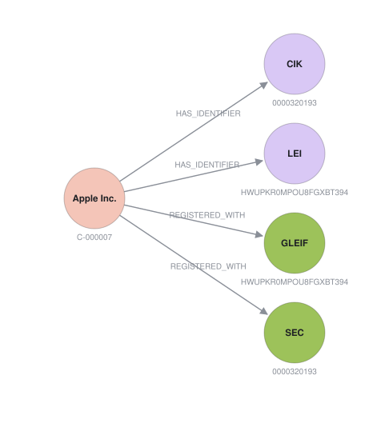
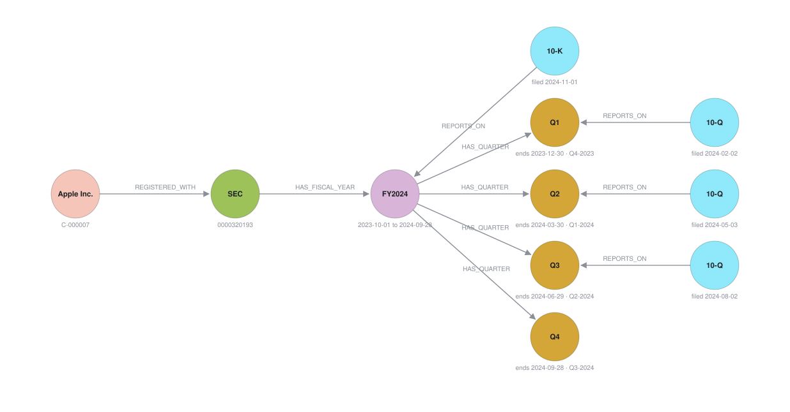
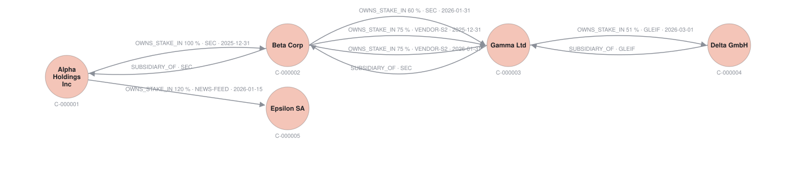

# graph-data-lab

A sandbox to test arkad's knowledge-graph data model on a real graph database and on Postgres.

The model started as a copy of arkad `sec/design/data_model/hybrid_data_model.md` §5. This repo
owns its copy and changes it freely. If a result is useful, port it back to arkad in a normal PR.

## What it tests

Each question from the arkad design runs as a query against both stores. Both results must equal
the same expected rows:

| Query | Question | Shape |
| --- | --- | --- |
| `missing_q3_2024` | Which SEC registrants have no report for the third quarter of fiscal 2024? | anti-join |
| `incomplete_fy2024` | Which SEC registrants miss any report of fiscal 2024? | anti-join |
| `filing_missing_concepts` | Which required concepts did a filing not report? | set difference |
| `ultimate_parent` | What is the top parent of each subsidiary? | multi-hop traversal |
| `ownership_tree` | Which companies sit below Alpha, and how deep? | multi-hop traversal |
| `conflicting_ownership_claims` | Which ownership claims disagree on the same date? | group by |
| `check_*` | The data-quality checks from §5.2 | filters |

## Layout

```text
model/
  MODEL.md          working copy of the graph model (nodes, edges, checks)
  schema.cypher     the model in Neo4j
  schema.sql        the same model as Postgres tables
fixtures/
  README.md         the seed companies and the planted gaps and violations
  seed.cypher       hand-written seed for Neo4j: fictional companies with planted violations
  seed.sql          the same seed for Postgres
  sp500.cypher      generated seed for Neo4j: 100 real S&P 500 companies from SEC EDGAR
  sp500.sql         the same seed for Postgres
  gleif_records.json  the GLEIF record per company, as fetched from the GLEIF API
  company_ids.json  our id of each company and the identifiers that lead to it
docs/images/        figures for the Markdown files, drawn from the data in Neo4j
scripts/
  render_figures.py       draws the figures in docs/images/ again
  load_stores.py          creates both stores from nothing, in a fixed order
  fetch_gleif.py          matches each S&P 500 company to its GLEIF record
  generate_sp500_seed.py  writes the two sp500 files and their expected rows
queries/<name>/
  query.cypher      the question in Cypher
  query.sql         the question in SQL
  expected.json     the rows both queries must return
tests/
  conftest.py       loads both stores from nothing through scripts/load_stores.py
  test_queries.py   runs every query on both stores
  test_parity.py    checks that both seeds hold the same data
pyproject.toml      dependencies and pytest settings, managed by uv
ruff.toml           format and lint settings
AGENTS.md           rules for agents working in the lab
DOCUMENTATION.md    rules for Python docstrings
.claude/skills/     agent skills: lab-testing, performance, plain-english,
                    xbrl-accounting, handoff
```

## Run it

You need Docker and [uv](https://docs.astral.sh/uv/). uv installs the Python version from
`.python-version` if you lack it.

```sh
docker compose up -d --wait
uv run pytest
```

`uv run` creates `.venv` and installs the locked dependencies from `uv.lock` on first use. To add
a dependency, run `uv add <package>` (or `uv add --dev <package>`) and commit `pyproject.toml` and
`uv.lock`.

Before you push, run the checks from the "Pre-Push Checks" section of `AGENTS.md`: format, lint,
type checks, tests, and the vulnerability audit.

The tests wipe both databases, then load the schema and the seeds. Do not point them at a
database you want to keep.

To create both stores from nothing without the tests, run:

```sh
uv run python -m scripts.load_stores
```

It loads `model/schema`, then `fixtures/seed`, then `fixtures/sp500`. The tests use the same
function, so both ways give the same stores.

Connection settings come from `NEO4J_URI`, `NEO4J_USER`, `NEO4J_PASSWORD` and `POSTGRES_DSN`. The
defaults match `docker-compose.yml`.

## Look at the data

Open the Neo4j Browser at <http://localhost:7474>. Log in as `neo4j` with password
`graph-data-lab`. Each query below returns a graph, so pick the "Graph" view of the result.

**A company, its identifiers, and its registrations.** Find it by a handle, here the LEI:

```cypher
MATCH (:Identifier {scheme: 'LEI', value: 'HWUPKR0MPOU8FGXBT394'})<-[:HAS_IDENTIFIER]-(c:Company)
MATCH p = (c)-[:HAS_IDENTIFIER|REGISTERED_WITH]->()
RETURN p
```



**What the SEC says about a company.** The fiscal year, its quarters, and the filings:

```cypher
MATCH p = (:Company {name: 'Apple Inc.'})-[:REGISTERED_WITH]->
          (:Registrant {source: 'SEC'})-[:HAS_FISCAL_YEAR]->(:FiscalYear)
          -[:HAS_QUARTER]->(q:FiscalQuarter)
OPTIONAL MATCH f = (:Filing)-[:REPORTS_ON]->(q)
OPTIONAL MATCH k = (:Filing)-[:REPORTS_ON]->(:FiscalYear {registrant: '0000320193'})
RETURN p, f, k
```



**All companies in one industry.** SIC 7372 is prepackaged software:

```cypher
MATCH p = (:Company)-[:IN_INDUSTRY]->(:Industry {code: '7372'})
RETURN p
```

**The ownership claims of the fictional companies**, with one conflict between two sources:

```cypher
MATCH p = (:Company)-[:SUBSIDIARY_OF|OWNS_STAKE_IN]->(:Company)
RETURN p
```



`model/MODEL.md` explains each picture: §5.5 for the adapters, §5.6 for company identity, §5.7
for the choice between a node and a property, and §5.8 for what works and what does not.

Three notes on the Browser:

- A result frame goes stale when the stores load again. Run the query again.
- To change what a circle shows, click its label in the result frame and pick a caption.
- The figures in this repo are not screenshots. `scripts/render_figures.py` runs a query per
  figure against Neo4j and draws the result, so the figures follow the data. Run it after you
  change the model or the seed: `uv run python -m scripts.render_figures`.

## Regenerate the S&P 500 seed

The generator needs a clone of arkad and the EDGAR bulk files `submissions` and `companyfacts`.
The generated files are in the repo, so the tests do not need either one.

```sh
uv run python -m scripts.generate_sp500_seed --arkad ../arkad --edgar ../data
```

The LEIs come from `fixtures/gleif_records.json`. To fetch them again from the public GLEIF API,
run this first. It takes about five minutes, because GLEIF allows 60 requests per minute.

```sh
uv run python -m scripts.fetch_gleif --arkad ../arkad --edgar ../data
```

## Add a question

1. Create `queries/<name>/`.
2. Write `query.cypher` and `query.sql`. Both must return the same column names.
3. Write `expected.json` as a list of rows. Row order does not matter.
4. If the question needs new data, add it to both seed files and list it in `fixtures/README.md`.

## Not covered yet

- LEI check digits (ISO 17442) and GLEIF status for the identifier check.
- The `REPORTS_CONCEPT` drift check against the adapter raw store.
- A filing's `period_end` against the dates of the fiscal period it reports on.
- Performance. The seed has 106 companies, so the timings mean nothing yet.
- Fiscal years other than 2024, and amendments (`10-K/A`, `10-Q/A`).
