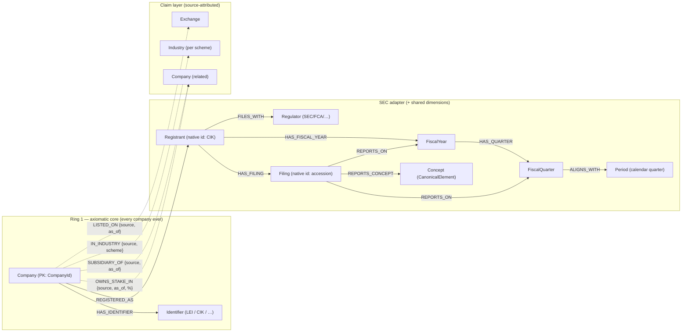

# Graph Model — Working Copy

> Copied from arkad `sec/design/data_model/hybrid_data_model.md` §5 at commit `24a9849`.
> This copy belongs to the lab. Change it freely here. If a change proves useful, port it back to
> arkad in a normal PR.
>
> Lab additions not in the arkad doc:
>
> - `FormType` node and `REQUIRES` edge. They hold the expected-concept set per form, which the
>   `REPORTS_CONCEPT` completeness check needs.
> - `HAS_IDENTIFIER.primary` flag. The "exactly one primary id" check needs it.
> - `LISTED_ON.listing_date` is optional. SEC EDGAR gives the ticker and the exchange of a
>   listing, but no listing date.
> - The ticker is part of the `LISTED_ON` key. A company can list several securities on one
>   exchange, for example Alphabet with `GOOG` and `GOOGL`.
> - An explicit adapter layer under the core company: `Registrant`, `FiscalYear`, and
>   `FiscalQuarter`. See "5.5 The adapter layer" below. It replaces `COVERS_PERIOD`,
>   `FILED_UNDER`, and the edges from `Company` to `Filing` and to `Regulator`.

## 5. Universal Knowledge Graph (Knowledge-Base Layer)

Models **identity, structure, and relationships** for every company worldwide. Reworked per
PR review (2026-08-08): built **from the minimal axiomatic core outward** — start with the
non-negotiables that hold for *every company ever*, then the SEC adapter, then the bridge
between them. Everything not independently verifiable (classifications, relationships) enters
as a **source-attributed claim** (§5.2), never as core truth. Keep the model minimal but
extensible.

### 5.1 Nodes — three rings

| Node | Ring | Key | Notes |
| --- | --- | --- | --- |
| `Company` | **core — axiomatic** | `company_id` (§4) | *the* non-negotiable node; entity_name, country, status |
| `Identifier` | **core — axiomatic** | `(scheme, value)` e.g. `(LEI, …)`, `(CIK, …)` | identity records attached to `Company`; each verifiable against its issuing registry (GLEIF, EDGAR) |
| `Concept` | core — ours by construction | `CanonicalElement` | our own vocabulary — axiomatic because *we* define it (enables "which concepts expected/missing") |
| `Period` | shared dimension | `key` e.g. `Q3-2024` | deterministic **calendar** quarter — verifiable by arithmetic, safe to share. Fiscal periods are adapter nodes (§5.5) |
| `Regulator`/`DataSource` | adapter-bridge | `code` (SEC, FCA, BaFin, ESMA) | |
| `Registrant` | adapter | `regulator + native_id` (SEC: CIK) | the company as the regulator knows it; the root of everything the adapter holds for a company (§5.5) |
| `FiscalYear` | adapter | `regulator + registrant + fiscal_year` | start_date, end_date as the 10-K declares them |
| `FiscalQuarter` | adapter | `… + quarter` (1 to 4) | start_date, end_date; the fourth quarter has no filing of its own |
| `Filing` | adapter | `regulator + native_id` (SEC: accession) | form, filed_date, period_end, taxonomy version |
| `Exchange` | reference data | `mic` (ISO 10383) | the *list* is a verifiable standard; any given *listing* is a claim (§5.2) |
| `Industry`/`Sector` | **claim layer — not core** | `scheme+code` (GICS/SIC/NACE) | classifications are source-owned opinions (GICS is S&P/MSCI's, SIC is the SEC's), multi-label, and disagree across schemes — attached only via source-attributed `IN_INDUSTRY` claims |

**Build order (review directive):** ring 1 (`Company` + `Identifier`) → the SEC adapter
(`Regulator`, `Filing` + structural edges) → the bridge (`HAS_FILING` via CIK→`CompanyId`
resolution, §11). Claim-layer nodes enter only as their sources are onboarded.

### 5.2 Edges — structural vs claims

**Structural edges** — adapter-verifiable (a filing either exists in EDGAR or it doesn't):

| Edge | From → To | Properties |
| --- | --- | --- |
| `HAS_IDENTIFIER` | Company → Identifier | since, status (active / lapsed) |
| `REGISTERED_AS` | Company → Registrant | the bridge from the core to the adapter (CIK → `CompanyId` resolution, §11) |
| `FILES_WITH` | Registrant → Regulator | first_filed |
| `HAS_FILING` | Registrant → Filing | |
| `HAS_FISCAL_YEAR` | Registrant → FiscalYear | |
| `HAS_QUARTER` | FiscalYear → FiscalQuarter | |
| `REPORTS_ON` | Filing → FiscalYear or FiscalQuarter | a 10-K reports on the year, a 10-Q on a quarter; absent while the period is unresolved |
| `ALIGNS_WITH` | FiscalQuarter → Period | the calendar quarter that holds the middle day of the fiscal quarter; for comparison across companies |
| `REPORTS_CONCEPT` | Filing → Concept | resolved confidence (structural completeness) |

**Relationship edges — source-attributed claims.** A relationship assertion is only as good
as its source, and sources disagree: `A OWNS_STAKE_IN B: 42% as of 2026-01-31 per S1` can
coexist with `… 53% as of 2026-01-16 per S2` (different `as_of` — a legitimate time series,
not a conflict) *and* with `… 53% as of 2026-01-31 per S2` (same `as_of` — a genuine
conflict). So every relationship edge carries a uniform **claim envelope** beside its payload:

- `source` — which adapter/dataset asserted it (provenance, §8.2)
- `as_of` — the date the assertion is *about*; `observed_at` — when we ingested it
- `verifiability` — `Verified` (regulatory filing / official registry) · `Reported`
  (reputable aggregator or data vendor) · `Alleged` (news, unconfirmed)

| Edge (claim) | From → To | Payload |
| --- | --- | --- |
| `LISTED_ON` | Company → Exchange | ticker, listing_date (optional) |
| `IN_INDUSTRY` | Company → Industry | scheme |
| `SUBSIDIARY_OF` | Company → Company | since |
| `OWNS_STAKE_IN` | Company → Company | percentage |

Rules: claims are **append-only and never destructively merged** — conflicting claims
coexist; which one "wins" is **read-time policy** (most-recent `as_of`, highest
verifiability, or "show all with sources"); cross-source **agreement upgrades confidence**,
divergence is itself a data-quality signal to surface — the same posture as the fact store's
multi-adapter rule (§2.1).

**Data-quality checks per element** (anchoring the review ask "how do we check consistency
for each of these"):

| Element | Check |
| --- | --- |
| `Company` | has ≥ 1 `Identifier`; exactly one *primary* id; no orphan companies |
| `Identifier` | validates against its scheme (LEI check digit, CIK format); LEI: GLEIF status current (issued, not lapsed) |
| `HAS_FILING` / `Filing` | filing exists verbatim in the adapter raw store (§8 drift check) |
| `FiscalYear` / `FiscalQuarter` | the quarters follow each other with no gap and no overlap and cover the year (`check_fiscal_quarters`) |
| `REPORTS_ON` | every filing reports on a fiscal period (`check_filing_has_period`) |
| `REPORTS_CONCEPT` | expected-concept set for the form type covered (completeness, §5.4) |
| ownership claims | `percentage ∈ (0, 100]`; `as_of ≤ observed_at`; conflict detector: same edge + same `as_of`, different payloads |

### 5.3 Diagram



### 5.4 Two workloads under one "graph" label

The knowledge-graph *modeling* lens covers two very different **query shapes**, and conflating
them oversells the need for a graph *engine*. Separating them sharpens the storage decision
(§13–§14):

**(a) Structural completeness — relational-shaped (bounded, shallow).** Despite the "graph"
framing, these are set/aggregate operations, not traversals — a row store does them *better*
than a graph engine:

- _"Which companies are missing a Q3-2024 quarterly report?"_ → an **anti-join**.
- _"Does FY2024 have all four quarters?"_ → a **GROUP BY / count**.
- _"Which required concepts did this filing fail to report?"_ → a **set difference** between
  expected `Concept`s and the filing's `REPORTS_CONCEPT` edges.

  1-hop edges (`HAS_FILING`, `REPORTS_ON`, `REPORTS_CONCEPT`) are just indexed joins. This
  is the **completeness engine**, and it stays comfortable in Postgres at the stated scale.

**(b) Relationship traversal — genuinely graph-shaped (deep, variable-depth).** The
`SUBSIDIARY_OF` / `OWNS_STAKE_IN` edges form corporate ownership networks:

- _"Ultimate parent of company X"_, _"full beneficial-ownership tree"_, _"all cross-holdings
  between two groups"_ → **recursive, multi-hop** traversals.

  Here a native graph engine (index-free adjacency, Cypher) materially beats recursive CTEs,
  which grow verbose and degrade with depth/branching.

**Consequence for the decision:** completeness (a) does *not* justify a graph database;
relationship traversal (b) is the only workload that does. So the §14 trigger for adopting a
dedicated graph store is specifically *"when multi-hop ownership/relationship analysis becomes
central,"* not the data-quality checks.

### 5.5 The adapter layer (lab addition)

The core `Company` knows nothing about fiscal years or filings. It delegates to an adapter through
one edge, `REGISTERED_AS`. Everything the SEC says about a company hangs below its `Registrant`:

```text
Company (core)
 └─ REGISTERED_AS → Registrant (SEC, CIK)
      ├─ FILES_WITH → Regulator
      ├─ HAS_FILING → Filing
      └─ HAS_FISCAL_YEAR → FiscalYear
           ├─ REPORTS_ON ← Filing (10-K)
           └─ HAS_QUARTER → FiscalQuarter ─ ALIGNS_WITH → Period (calendar)
                └─ REPORTS_ON ← Filing (10-Q)
```

- **A fiscal period is adapter data, not a shared dimension.** Apple's fiscal year 2024 runs from
  2023-10-01 to 2024-09-28. No arithmetic gives these dates: the filing declares them. So the
  node has a source, and `check_fiscal_quarters` tests it for consistency.
- **A fiscal year number is the filer's own label.** NVIDIA calls the year that ends in January
  2024 "fiscal 2024". Target gives that name to the year that ends in February 2025.
- **`Period` stays a calendar quarter in the trusted core.** `ALIGNS_WITH` connects a fiscal
  quarter to it. Use this edge to compare companies with different fiscal years.
- **A filing stays attributable.** It hangs on the period it reports on, so each period leads to
  its source in one hop. `HAS_FILING` holds every filing, also one whose period is unresolved.
- **The fourth quarter has no 10-Q.** Its node exists, and its numbers are the year minus the
  first three quarters.
- **A second regulator adds a second `Registrant`** below the same company, with its own fiscal
  years. The core does not change.
- **`Identifier (CIK)` and `Registrant` overlap on purpose.** The identifier is the identity
  record in the core. The registrant is the root of the adapter data.
